# Version 5.0 - ISAN 2.5.3 + up to 30 Waypoint System + Ship and Waypoint Heading
(Thanks to Storm_UK for the 30 waypoint refactor.)
### Changes 9/8/21 version 5.0: Increased to 30 waypoints, increased name length to 10 char, added ability to rapidly preview waypoint before selecting it, removed need for warning buttons.  IMPORTANT: Waypoints field names on mem chips are now w1 to w30 instead of wp1 to wp30.  Waypoint format changed to `"Center \nX:0 \nY:0 \nZ:0"` (yes with the `\n`'s)

#### Single Board Install
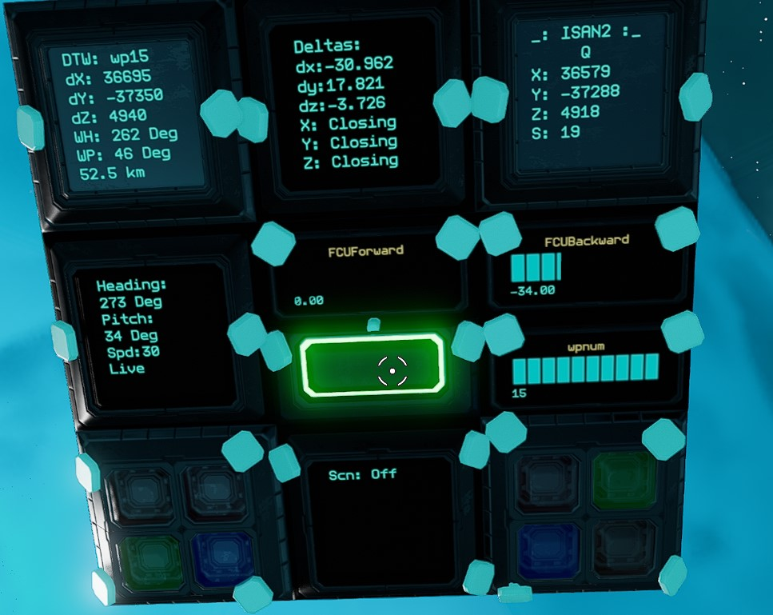
 
#### Dual Board Install
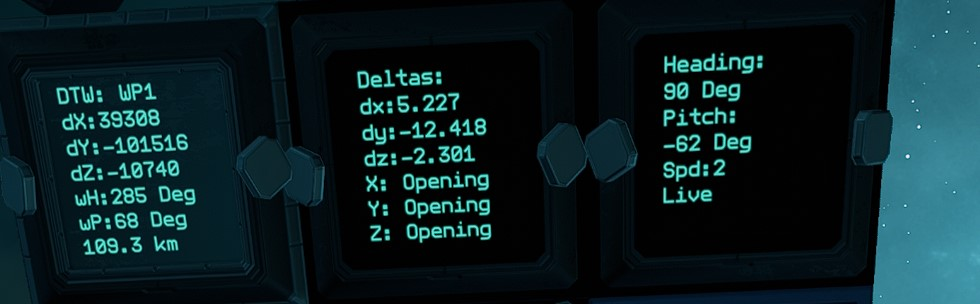
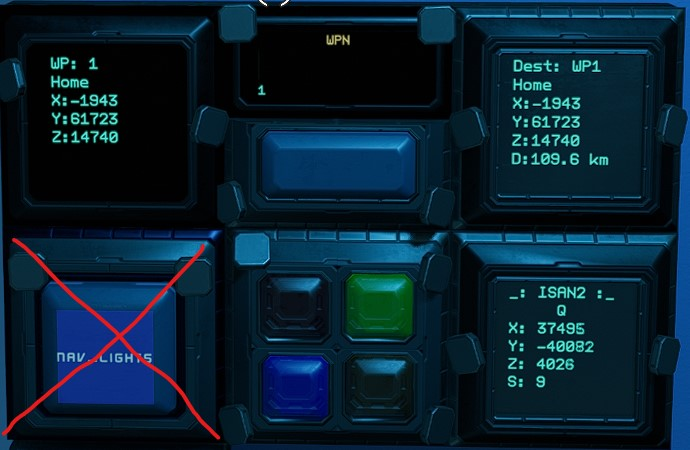

This is the ISAN system from the Collective. 

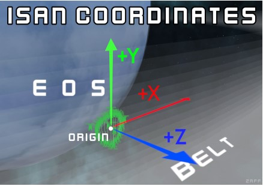

It has been modified to work with my waypoint system and adding in heading and pitch for both ship and to waypoint.  The system will store up to 30 waypoints, cycle up and down (wrapping at the ends) and has an overwrite and home feature (goes to wp1).

"Pitch is your "vertical" angle from the Z axis with 0 being flat along the plane of the belt, and -90 and 90 being perpendicular.
Heading is your "horizontal" angle from the Z axis with 0 being along it pointing into the belt, 90 being along the X axis pointing "left" along the belt, and it wrapping back around to 360 pointing back into the belt"

To test accuracy, aim at the middle of EOS (the big planet) and fly slowly (like 20m/s or less).  You should see a heading of 180 and a pitch of 0.

# Getting Started
You can install all or part of this system. These instructions assume you are installing it all. The ISAN.yolol is the same as the one found on their github as of 9/8/21, except it has been modified for Mono mode accuracry (pr=1), speed indication (sp=1),memory chip storage of X, Y and Z, and support of heading and pitch system.  Do not use vanilla ISAN with this system.   
##### If using quad mode, change pr=1 to pr=0 on line 1 of isan.yolol

#### Materials List for whole system
* (Required) Advanced YOLOL Chip - ISAN.yolol script - This is the ISAN script
* (Required) Advanded YOLOL Chip - 30WPDTW.yolol script - This is the current selected waypoint screen info script
* (Required) Advanced YOLOL Chip - ShipHeading.yolol script - This is the ships heading screen info script.
* (Required) Basic YOLOL Chip - 30WPIncrement.yolol script - This is the script for changing between waypoints.
* (Required) 5 Buttons - Used for WP Increment, WP Decrement, WP Save, and WP Home Select and WP Apply. These can be any type, I recommend 4 smalls (12x12) and 1 medium (12x24)
* (Optional) Basic YOLOL Chip - Deltas.yolol, needed if display of current deltas is desired.
* (Flexible) 3 to 5 YOLOL Memory Chips - One for storing `X`, `Y`, `Z` and current WP's `wx`, `wy`, `wz`, `i`, `j`, and `k`, and `spd`. Another chip for `wpu`, `wpcn`, and`wpc` And then 1 memory chip per 10 waypoints
###### Note: If using 6 or fewer waypoints, you can get away with 2 memory chips by putting w1 to w2 on chip 2.
* (Flexible) 6 24x24 Text Screens - One for ISAN, one for ships heading/pitch, one for current selected waypoint delta, one for browsing waypoints info, one for destination info, one for current ship delta info
###### Note: Any screen can be skipped so long as its :field variable is available somewhere (memory chip, progress bar, whatever)
* (Flexible) 1 progress bar - Used to display current WP by the selectors. If not present and you hold inc or dec too long, you might skip over wp number.
###### Note:  If progress bar not used, then `:wpn` must be available somewhere (memory chip)

1. Install all components and chips for desired level of system.  Be sure to bolt them in where appropriate.  Remember Memory chips only go in one way and can vanish if not inserted properly.  Recommend inserting memory chip, then yaw slightly on ship, see if its still in place.
`Note: All pictures below are from a "live" system.  Use the values shown in the Readme instead of the pitcutes.`
1. Install Memory Chip 1.  On the chip, set the following fields: `X`, `Y`, `Z` to 0, `wx`, `wy`, `wz` to 0, `i`, `j`, `k` to 0, and `spd` to 0 

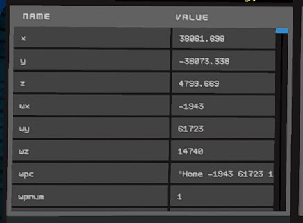
1. Install Memory Chip 2.  On it set fields `wpu`, `wpcn` to 1, and set `wpc` to `"Center \nX:0 \nY:0 \nZ:0"` (quotes included). 

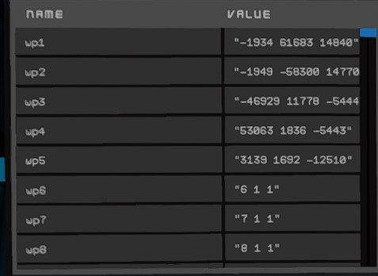
1. Install Memory Chip 3.  On the chip, set the fields to: `w1` to `w10`.  Set the values to `"Center \nX:0 \nY:0 \nZ:0"` (quotes included) unless you have specific waypoints you want to put in. 

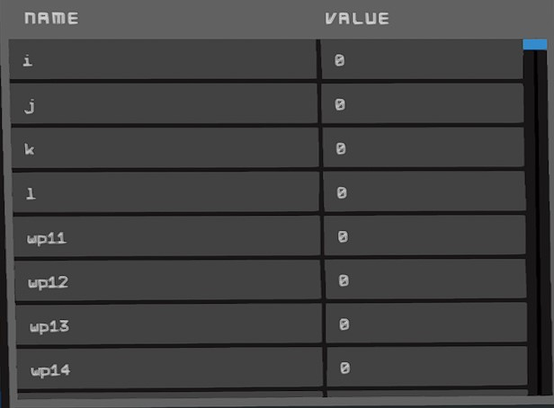
1. (OPTIONAL) Repeat with Memory Chips 4 and 5 if using 20 or 30 waypoints. `w11` to `w20` and `w21` to `w30`
1. Install the modified ISAN.yolol from here on an Advanced Chip.  Set up the receivers fields and ISAN text screen name (`_`) per https://isan.to/isan.pdf. The Waypoint system doesnt care if you are mono or quad mode.  If quad mode, set pr=0 on line 1 to turn off precision.  
`NOTE: The isan.yolol in this folder is modified, do not use the vanilla ISAN. (Display and Reciever fields should be updated as shown in the PDF)` 

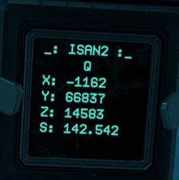
1. Install ShipHeading.yolol on an advanced chip.  
    1. On a text screen, rename PanelValue field to `Heading`  This will show current live heading after its established.

    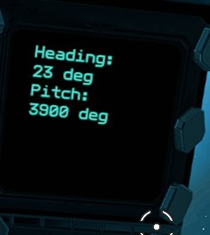 
1. Install 30WPDTW.yolol on an advanced chip.  
    1. On a text screen, rename PanelValue field name to `DTW`.  This will display Waypoint Number, WP Heading and WP Pitch, and delta X, Y, Z and distance to it. 
    
    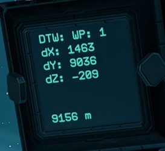  
1. Install 30WPIncrement.yolol on an basic chip. Set the value of `a` on line 1 to your total maximum number of waypoints.
    1. On a text screen, rename PanelValue field to `wp`.  
    
    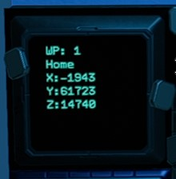  
    1. On a second text screen, rename PanelValue field to `dest` 
    
    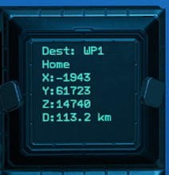  
1. (OPTIONAL) Install Deltas.yolol on basic chip.  
    1. (If deltas.yolol installed) On a Text Screen, rename PanelValue field name to `Deltas`.  When moving, this will show your current delta X, Y and Z along with OPENING or CLOSING in reference to X, Y and Z to selected Waypoint.
    
    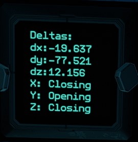
1. Install 4 buttons. Rename ButtonState field names to `wpi`, `wpd`, `wps`, `wph`.  (Increment, Decrement, Save, Home). ButtonStyle should be 0.  ButtonColor is user preference. 

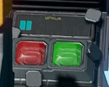  
1. Install 1 button.  Rename ButtonState field name to `wpl`.  ButtonStyle should be 1 for this button.   This is the button you press after you find desired waypoint to send it to system for use.
1. Install progress bar near buttons if needed to show currently selected waypoint. Name PanelValue to `wpn`.  Minvalue 0, maxvalue 30 (or your total number of waypoints).
1. (OPTIONAL) You can put SPD on any extra display you want to display just speed.  Currently displayed on ISAN panel and on Ships Heading panel.
1. (STREAMERS) You can put `_` on a memory chip or other non-display device and the entire system will work without the ISAN text display.  Also the `wp` and `dest` values and screens can be done the same way.

#### Usage Instructions - Note, if any displays look bad, ensure that all scripts are forced to start from line 1.
1. During normal flight: 
    1. The ISAN screen will show you current X, Y and Z and Speed.  
    1. The Deltas screen will show you your current X, Y and Z deltas based on current flight direction and speed along with XYZ OPENING or CLOSING to your current selected waypoint, IF MOVING.
    1. The DTW screen will show currently selected waypoint number, the WP Heading and Pitch to it, and delta X, Y, Z amd dostamce to it.  
    1. The Heading screen will show heading, pitch and speed.  If it says Live at bottom, its updating, if it says Last, you are not moving so its the last reading it calculated.  
    ###### NOTE: Ships heading is stable AFTER flying in a straight line for a bit, recommend doing at slow speed till desired heading reached.
1. To fly to your waypoint: (recommend using combo of both methods)
    1. Method1: Use delta X/Y/Z shown on DTW screen and Deltas screen.  If DTW says you are dx: -500 then you would want the dx on the deltas screen to say a positive number.  Also if all 3 fields on the Deltas screen say CLOSING you are going in right general direction, but note the magnitudes of the deltas.  NOTE: This is the most accurate since if it says you are 500 off in X direction, you are 500 off. 
    1. Method2: Use the WH and WP shown on the DTW screen.  Start flying VERY slowly (just need relative motion) till your Ships heading stops jumping around (Transmitter related, not ISAN or waypoint code).  Then yaw till heading on Ships Heading display is close to WP Heading on DTW display. Then pitch till your ships pitch is close to WP Pitch.  Then you can accelerate to full speed.  Note:  These numbers do sometimes radically shift for a second due to transponder issues, fps issues, lag, etc.  Use the stable values.  I have twiced tested turning off station markets and flying back to my Origin from 40k in belt in fog with no idea which way to go first. Both times it got me home just fine.
##### IMPORTANT: When using the Waypoint buttons, tap them to increment up or down by 1, hold to speed through waypoints. Release button and wait for blinking to stop before pressing another.  DTW display will show PARSING WAYPIONT while its changing over.
1. To raise or lower current waypoint, tap the Increment or Decrement warning button to change by 1, or hold to change fast to another number.  It wraps from 30 to 1 and 1 to 30. 
1. Once selected, hit the WPL (load button) to force the set current waypoint to the shown waypoint.
1. To overwrite current viewed waypoint, press the Save button.  This does not change the Set waypoint. 
### To name a waypoint, on the memory chip after its saved, add the name to the front of the string up to 10 characters, i.e. "home -1943 61723 14740"  If no name is present it will just use `[Unnanmed]` as the name.
1. To go to waypoint 1 press the Home  button. (Saves time if you are on waypoint 15 for example).  Waypoint 1 is always considered home.

IF SOMETHING ISN'T WORKING - Recommend putting chips on a socket or chip reader insert so you can watch them run live and see where they are getting stuck, this will let me give better tech support.