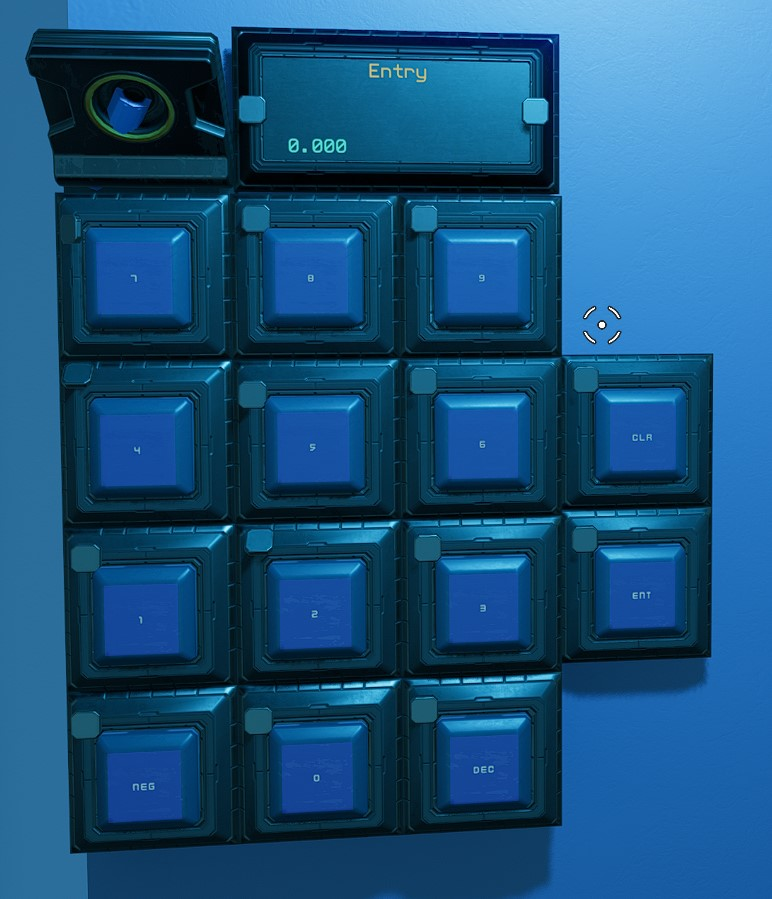

#NumberPad

This is the script for a numberpad that allows input of number for use in other systems.

NOTE: This is a generic example that supports assigning entered number to a user defined variable.

The comments in the code can be left out of course, but here they are for how to use the system.
// :1 to :0 are number buttons first field name.  The On value is the
// number (i.e. :5 on value is 5), the off value is 0.
// :ent :clr are enter and clear buttons first field name.  On value
// is 1, off value is 0.
// :neg is the negative button first field name.  On value is -1, off
// value is 1
// :dec is the decimal button first field name.  On value is 1000, off
// value is 1
// :Entry is the number panel display.  :dbg is the variable the final
// number will be assigned to, rename this as needed.
// To use: press negative or decimals if needed. Enter the numbers one
// at a time, making sure they appear on the Entry panel. When
// complete hit Enter button to assign it to your :dbg variable.